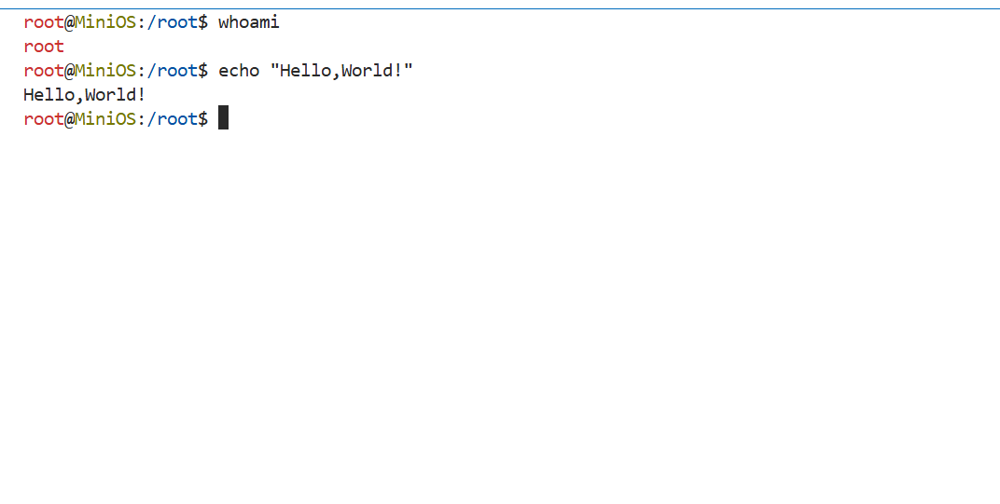

# 🖥️ MiniOS: Simulated Operating System in Python

### *By Shiboshree Roy — Programmer | Software Engineer | Open Source Contributor | Technologist*

---
### Demo CLI Image

---
## 📚 Introduction

**MiniOS** is a lightweight, Python-based simulated operating system designed to model core OS principles through a fully interactive shell. Built entirely in Python with no external dependencies, MiniOS provides a sandboxed environment that emulates Unix-like behavior, including file permissions, user management, process control, and shell utilities.

Ideal for education, experimentation, and development of operating system fundamentals — all within a self-contained Python application.

---

## ⚙️ Core Features

### 🗂️ Virtual File System

* UNIX-style hierarchical directory tree (`/`, `/home`, `/etc`, etc.)
* File & directory CRUD operations
* Permission model: `rwx` per user, group, others
* Ownership management via `chown`, `chmod`
* Simulated I/O redirection and persistence layer

### 👥 User & Group Management

* Support for multiple users with individual home directories
* Root and non-root user capabilities
* Enforced permission checks on files and directories
* Built-in password authentication and account security
* User and group creation/modification (`useradd`, `passwd`)

### 🔧 Process & Job Control

* Simulated process system with background jobs
* `ps` for viewing active processes, `kill` to terminate
* Foreground & background execution via `&`
* Basic job control and scheduling emulation

### 🖥️ Interactive Shell

* Custom shell interface modeled after UNIX shells
* Command history and recall with `history`
* Shell utilities: `ls`, `cd`, `cat`, `grep`, etc.
* Basic input/output redirection support (`>`, `<`, `>>`)
* Environment variable system (`export`, `env`)
* Authentication and session management

### 💾 Persistence Engine

* Stateful filesystem and user data retained between sessions
* Persistent command history saved per user

---

## 🚀 Getting Started

### ✅ Requirements

* **Python 3.6+**
* No third-party dependencies — 100% standard library

### ▶️ Run MiniOS

```bash
python minios.py
```

---

## 🧪 Shell Commands Reference

| Command   | Description                            |
| --------- | -------------------------------------- |
| `help`    | Display available shell commands       |
| `ls`      | List directory contents                |
| `cd`      | Change working directory               |
| `pwd`     | Print current working directory        |
| `cat`     | Display contents of a file             |
| `touch`   | Create a new empty file                |
| `mkdir`   | Create a new directory                 |
| `rm`      | Delete a file                          |
| `rmdir`   | Delete an empty directory              |
| `edit`    | Modify file content in shell           |
| `chmod`   | Change permissions of a file/directory |
| `chown`   | Change file/directory ownership        |
| `useradd` | Add a new user (requires root)         |
| `passwd`  | Change user password                   |
| `ps`      | List simulated processes               |
| `kill`    | Terminate a simulated process          |
| `env`     | Display environment variables          |
| `export`  | Set an environment variable            |
| `grep`    | Search for patterns inside files       |
| `history` | Show command execution history         |
| `clear`   | Clear the shell screen                 |
| `whoami`  | Show current user identity             |
| `logout`  | Log out of current session             |
| `exit`    | Shut down MiniOS shell                 |

---

## 🧑‍💻 Developer Workflow (Sample Session)

### 🔐 Log in

```bash
Login: root
Password: root
```

### 🗃️ File System Interaction

```bash
cd /home
mkdir dev-lab
cd dev-lab
touch hello.py
edit hello.py
cat hello.py
```

### 👥 User Administration

```bash
useradd alice
passwd alice
chown alice:users hello.py
chmod 755 hello.py
```

### ⚙️ Simulating Processes

```bash
sleep 30 &
ps
kill 1
```

### 🌐 Environment & Shell

```bash
export PATH=/usr/bin:/bin
env
grep 'def' hello.py
history
```

---

## 🧠 Designed For Learning & Exploration

MiniOS is a teaching-oriented platform — ideal for:

* Operating System coursework
* Shell scripting fundamentals
* System design prototypes
* Safe experimentation with OS-level concepts

---

## 🤝 Contributions Welcome

MiniOS is open source and actively maintained. Contributions from developers, educators, and OS enthusiasts are highly encouraged.

📂 GitHub Repository: *Coming Soon*
📧 Contact: *[shiboshreeroycse@gmail.com](mailto:shiboshreeroycse@gmail.com)* (placeholder)

---

## 🏁 Roadmap & Enhancements

* [ ] Tab-completion and command suggestion
* [ ] Full background process queuing
* [ ] Filesystem mounting simulation
* [ ] Networking stubs
* [ ] Module-based plugin architecture

---

**Crafted by Shiboshree Roy**
*“Because building a system is the best way to understand one.”*

